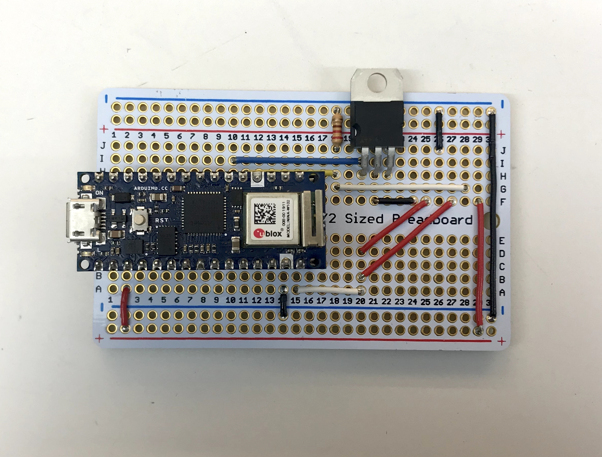

# Hardware

<!-- vim-markdown-toc GFM -->

* [Circuit Components](#circuit-components)
* [Circuit Layout](#circuit-layout)
* [Software Pipline](#software-pipline)
* [Thoughts behind the circuit and the program](#thoughts-behind-the-circuit-and-the-program)
	* [1. High current through flashlight](#1-high-current-through-flashlight)
	* [2. Message transmission](#2-message-transmission)
		* [- Binary data selection](#--binary-data-selection)
		* [- Time synchronization](#--time-synchronization)
	* [Circuit Layout](#circuit-layout-1)

<!-- vim-markdown-toc -->

## Circuit Components
- Arduino NANO 33 IoT
- TIP120 transistor
- Super bright LED (flashlight)
- Arcade button

## Circuit Layout
 
>circuit layout

- White led stands for the flashlight
- Red led and round button stand for the arcade button.
- The transistor(TIP120) is for controlling the flashlight, allowing high voltage between it. Practically, the voltage is around 3.5 volt.

## Software Pipline
 
>Software Pipline

## Thoughts behind the circuit and the program

### 1. High current through flashlight
The flashlight we use is working properly under 3V. But due to some reasons the digital output pin only output 2.5V as most. Then we decided to use Vin to supply 5V, thus to let it emit enough brightness.

So instead of using digital output to drive the flashlight, we use a transistor to control it, which in turn supply 3.5V in practice. Since we just let it turned on for 1 second, so we thought it's OK to let it be under the voltage a little greater than the standard value.

### 2. Message transmission

#### - Binary data selection
To ensure that the message is sent fast and correctly, we sent binary data `0` from Arduino to p5 through serial, and binary data `255` from p5 to Arduino. 

The reason we choose `0` and `255` is that, when we sent binary data, it is sent in the format of the following:
|0|0|0|0|0|0|0|0|
|-|-|-|-|-|-|-|-|
So when we sent `0` like above and if there's noise in the channel, the message would look like:
|0|0|1|0|0|0|0|0|
|-|-|-|-|-|-|-|-|
where the third digit is noised. However, little chance will it be that the message become `255`, which is in the format of following:
|1|1|1|1|1|1|1|1|
|-|-|-|-|-|-|-|-|
Nonetheless, in our project the massege if transmitted through cable, which is pretty stable. But this strategy is useful when it's under wireless communication environment.

#### - Time synchronization
Since we need flashlight to provide enough brightness for the camera to take the snapshot, we need a mechanism to control the timing of turning on/off the flashlight.

The strategy we use is that: after the flashlight is turned on and 1 sencond's delay, giving the camera time to adjust focus and face-tracking model to work, the Arduino sent the massege to p5, telling it to take the picture. After the whole image process in p5, it will send the message to Arduino, ensuring that the camera has enough brightness and time to take clear pictures.

### Circuit Layout
The whole circuit is soldered on a proto-breadboard, with necessary headers as hardware interfaces, for the reason that we want to keep both robustness and flexibility when we build on it latter.

>Soldered Circuit
