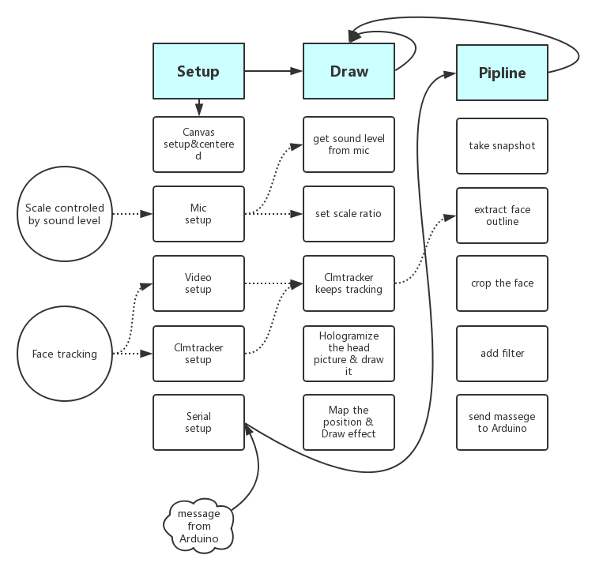

# Software

<!-- vim-markdown-toc GFM -->

* [Software diagram](#software-diagram)
* [Spects](#spects)
	* [Face Tracking](#face-tracking)
	* [Sound control](#sound-control)
	* [Hologramization](#hologramization)
	* [Bloody Effect](#bloody-effect)

<!-- vim-markdown-toc -->
## Software diagram
 
>Software Diagram

## Spects

###  Face Tracking
The main part of our program is to extract people's face when they push the button. So we've searched some JavaScript libraries of tracking human's face. At first we tried out PoseNet in ML5, which is pretty fast and with capability of real-time tracking, but it can only return the positions of some facial features.

Thanks to Fanyi's effort on researching and testing, we finally decided on [CLMtracker](https://github.com/auduno/clmtrackr). This is a JavaScript library that can return the contour of human's face, which perfectly fits our needs. The greatest part of this library is that, it can not only return the contour of the face, but also contours of some facial features like eyes, nose and mouse. This provides great convenience for us to add special effect on the face.

### Sound control
We use the microphone to detect the sound level in the environment. Initially we were considering some methods to smooth out the noise in the background, but the function turns out to decrease the sensitivity. So we just pass the sound level directly to the scale.

### Hologramization
To present the patern in hologram, we need to transform tracked face into a picture of four, scaled real-time by sound level. The whole process is done after converting the picture into image data/object.

The first step is to mask the face out, since we just need the face presented without the background. So we utilize the positions array returned from CLMtracker to make the mask, then extract it out using `image.mask()`.

In order to get a better result of scaling face size, we need to crop the image into face's size. So we take the rectangle tangential to the edge of the face, then copy that part of the original image into a new one. In this case we can simply add scaling to that face regardless of variation in size due to the distance from camera.

At the same time of croping, we also map the positions of key features on face into the positions on the final hologramized picture. This means that we can design the facial effect separatly on the canvas, then just pass the positions straightly into the function to draw them on the final hologramized picture.

### Bloody Effect
The initial idea is to put blood on the face, to make the face looks creepy. In the beginning we put a green contour on face and red cascade on eyes and mouth, staticly. But then we hope to make it more dynamic.

So we designed the pattern of bleeding from eyes, nose and mouth. We put drop-shaped patern on the positions of mentioned facial features, then the length of the drop will increase as time gose. When there's a new face, the length will be restored.
